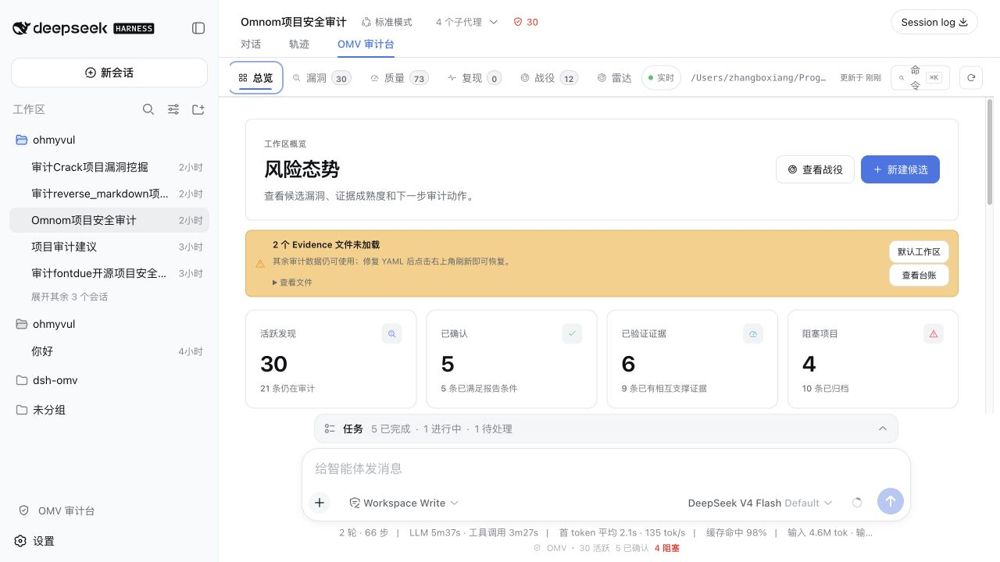

# OMV Audit Desk (`dsh-omv`)

### Evidence-first vulnerability research inside DeepSeek Harness

[](https://github.com/bx33661/dsh-omv/actions/workflows/ci.yml)
[](https://nodejs.org/)
[](https://github.com/deepseek-ai/deepseek-harness)
[](./LICENSE)

[中文文档](./README.zh-CN.md) · [Architecture](./docs/architecture.md) · [DSH integration guide](./docs/dsh-integration.md)

<p align="center">
  
</p>

OMV Audit Desk is a native [DeepSeek Harness](https://github.com/deepseek-ai/deepseek-harness) plugin for evidence-driven vulnerability research. It connects [oh-my-vul](https://github.com/bx33661/oh-my-vul) workspaces to DSH sessions, tools, commands, workspace state, and settings.

The package id remains `dsh-omv` for installation compatibility; the product name shown in DSH is **OMV Audit Desk**.

## What it adds to DSH

| Surface | What it provides |
| --- | --- |
| Audit desk | Evidence maturity, finding queue, quality signals, Campaign graph, reproduction lab, PoC lab, search, and recent activity. |
| Native Agent tools | 29 OMV tools with typed output, cancellation guards, file locations, and OMV-specific Tool Cards. |
| Durable workflows | Finding ↔ Session links, Campaign Runner lanes, restart recovery, structured reproduction Runs, deduplication, review, reporting, and disclosure hand-offs. |
| Evidence model | Evidence.v1 and Campaign.v1 remain authoritative; the UI projects source, sink, guard, reproducer, observed result, provenance, and next action. |
| Extension seam | A workspace-scoped `ctx.omv` service plus typed `dsh-omv/tool-result` events for other plugins. |

## The research loop

```
orient → inspect → reproduce → review → confirm → report → disclose
   │         │          │          │
   └─────────┴──────────┴──────────┴── every step stays linked to Evidence.v1
```

- **Findings** keep candidate, investigating, reproducing, confirmed, report-ready, disclosed, blocked, and archived states visible.
- **Evidence** keeps `source → sink → guard`, doctor issues, review verdicts, open questions, hashes, diffs, and reproduction results traceable.
- **Campaigns** turn targets into bounded DSH fork sessions with pause, resume, cancel, retry, lane status, and restart recovery.
- **PoC runs** move from generated draft to explicit approval, Docker isolation, result inspection, artifact hashes, provenance, and human evidence adoption.

## Native DSH integration

The plugin has two coordinated faces:

- **Host** — HTTP bridge, 29 tools, 20 slash commands, system-prompt guidance, the `omv` Cordis service, workspace scoping, and file watching.
- **Client** — Vulnerability Audit view, session header state, composer context, command rows, settings section, workspace launcher, and keyed `tool.call.toolview` cards.

It uses DSH seams instead of maintaining a parallel shell: native workspaces and sessions, DSH alias colors, host typography, session replay, SSE updates, and the normal plugin lifecycle.

### OMV Tool Cards

Cards keep the conversation compact while exposing OMV action, salient target, running/completed/failed/interrupted state, expandable arguments and results, and a trajectory inspection action when the host provides it. Non-OMV tools keep the DSH generic presentation.

## Highlights

- Evidence maturity across five contextual dimensions, with exact blockers and next actions.
- Finding ledger with candidate, confirmed, blocked, and archived views.
- `source → sink → guard` inspection, Evidence diffs, review verdicts, open questions, and provenance.
- Campaign Runner with bounded concurrency, one native fork session per lane, pause/resume/cancel/retry, and restart recovery.
- Reproduction lab, dedup intelligence, quality center, report-readiness signals, and Campaign Graph.
- PoC drafts with explicit approval, Docker isolation, artifact hashes, provenance, and manual Evidence adoption.
- Workspace-wide search, recent activity, native DSH Job status, SSE synchronization, and polling fallback.
- 29 native model tools, 20 durable `/omv*` commands, and a typed `ctx.omv` service for other plugins.

## Install

Current releases are installed from a checkout, local package, or GitHub release tarball. The package is not published to npm, so `npm install` prepares a checkout rather than downloading `dsh-omv` by name.

### Source development (recommended for UI work)

Use a local link when you need hot reload. The link points the profile at this checkout, while `npm run dev` watches `src/` and lets DSH client-HMR refresh the open page.

```bash
cd /path/to/dsh-omv
npm install
dsh plugin --profile web add link:.
npm run dev
dsh --profile web
```

Keep `npm run dev` running while editing. React component state may reset according to DSH HMR behavior; this is not full page-state persistence. If the profile previously used a regular local install, switch it explicitly:

```bash
dsh plugin --profile web remove dsh-omv
dsh plugin --profile web add link:.
```

### Stable local install

Use this mode when you want to run a fixed checkout without hot reload. After source changes, rebuild and add the local package again.

```bash
cd /path/to/dsh-omv
npm install
npm run build
dsh plugin --profile web add .
dsh --profile web
```

### Packed install

Use a tarball to transfer or install a specific build on another machine. `npm pack` prints a versioned filename; use the actual filename it prints. A tarball does not provide source hot reload.

```bash
cd /path/to/dsh-omv
npm install
npm pack --silent
dsh plugin --profile web add ./dsh-omv-<version>.tgz
dsh --profile web
```

Local checkouts and already-built tarballs do not need an extra pnpm `allowBuilds` entry. Update an installed package with `dsh plugin --profile web update dsh-omv`, or remove it with `dsh plugin --profile web remove dsh-omv`.

The **Vulnerability audit** entry opens or reuses the configured DSH Workspace. Every session then exposes a **Vulnerability audit** tab beside Chat and Trajectory. Verify the profile after installation with:

```bash
dsh --profile web --dump-config
```

The output should include the `dsh-omv` configuration layer. If source changes do not appear, confirm that the profile uses `link:.` and that `npm run dev` is still running.

## Configure

Override the row in `$DSH_HOME/profiles/web/cordis.patch.yml`:

```yaml
- id: dsh-omv
  config:
    projectRoot: '/absolute/path/to/repository'
    apiPrefix: '/api/dsh-omv'
    allowMutations: true
    allowRemoteAccess: false
    activityLimit: 60
    refreshIntervalMs: 15000
    campaignConcurrency: 3
    watchDebounceMs: 90
    eventHeartbeatMs: 20000
    httpBodyLimitBytes: 262144
```

Relative `projectRoot` values resolve from the directory where DSH starts. A patch replaces the complete `config` value, so retain every field you still need.

## Security model

- By default the API is loopback-only: the client address must be `127.0.0.1`/`::1` and the `Host` header must be `localhost`/`127.0.0.1`/`[::1]`. The Host check blocks browser DNS-rebinding pages from reading `/export` or forging `/action` mutations.
- **`allowRemoteAccess: true` disables both guards, and the whole API (including every mutation action) has no authentication.** Only enable it on a trusted network, behind your own auth proxy or network isolation.
- Local access through a non-loopback hostname (for example a custom hosts domain) also requires `allowRemoteAccess: true` to pass the Host check.

Other plugins can consume the host capability without depending on the HTTP bridge:

```ts
import type { Context } from '@deepseek-ai/cordis'

export const inject = ['omv']
export function apply(ctx: Context) {
  ctx.on('dsh-omv/tool-result', event => {
    console.log(event.name, event.ok ? 'ok' : 'failed')
  })
  void ctx.omv.workbench.health()
}
```

See [README.zh-CN.md](./README.zh-CN.md) for architecture, API, packaging, and configuration details.
The implementation-to-guide checklist and follow-up iterations live in [docs/dsh-integration.md](./docs/dsh-integration.md).

## License

MIT


## Project structure

The source is split across the DSH host entry, client pages, UI primitives, runtime adapters, and shared contracts; all tests live under `tests/`. See [`docs/architecture.md`](./docs/architecture.md). The repository keeps one curated workbench preview at [`docs/assets/workbench-overview.png`](./docs/assets/workbench-overview.png); build archives, local `.omv` data, and test captures are ignored.
