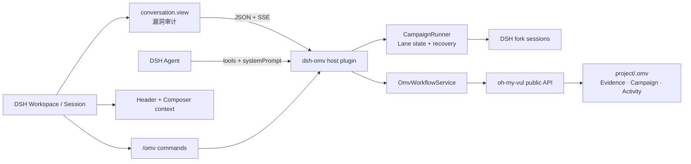

# OMV 审计台（dsh-omv）

`OMV 审计台` 是面向 [DeepSeek Harness](https://deepseek-harness.github.io/deepseek-harness/develop/basic/) 的证据优先漏洞审计工作台，包名保持为 `dsh-omv` 以兼容现有安装。它复用 `oh-my-vul` 的 Evidence.v1、Campaign.v1、工作区索引和发现生命周期，并直接进入 DSH 的工作区、会话、命令、工具、Composer 与设置体系，不再运行一套独立的插件外壳。

## 能力

- **风险态势总览**：活跃发现、确认数，以及“尚未映射 / 正在成形 / 证据支撑 / 已经验证 / 存在争议”的证据分布；不再用平均完成度概括不同阶段的研究。
- **优先审计队列**：按 OMV 工作流优先级展示每条发现及精确下一步动作。
- **Evidence.v1 详情**：并排呈现 `source → sink → guard`、五维证据成熟度、未决问题、doctor issues 与 review verdict。
- **Audit Loop 状态机**：从 candidate、investigating、reproducing、confirmed、report ready 到 disclosed，并根据 Evidence 自动推导阶段。
- **Finding ↔ Session**：将每条发现持久绑定到 DSH 会话，保留最近工作流、时间线与恢复入口。
- **一键 Agent 工作流**：从详情页直接派发深审、复现、去重、对抗审阅、报告和披露任务到当前 DSH 会话。
- **Evidence Diff**：记录插件动作前后的哈希、增删行和紧凑补丁，JSONL 尾部损坏时可恢复既有历史。
- **漏洞发现台账**：筛选 candidate / confirmed / blocked / archived，查看与恢复归档记录。
- **Campaign Runner**：每条 Lane 对应一个原生 DSH fork 会话，支持并发控制、暂停、恢复、取消、失败重试和 DSH 重启恢复；完成、阻塞与待证据分别统计，阻塞 Lane 不再被算作已完成。
- **Campaign 配置诊断**：逐文件隔离异常 YAML，自动归一化 `rubygems → ruby` 等常见仓库别名，并可在工作台中修复派生标题与 runbook 元数据。
- **Evidence Graph**：把 claim、source、sink、guard、reproducer、observed result、会话与产物组织成可追溯证据图。
- **情境化提交条件**：将数据流、运行时验证、影响范围、结论可信度和报告材料分开判断；候选阶段只提示研究建议，确认后才启用提交条件，且不再把提交分数反向作为证据门槛。
- **结构化复现 Run**：记录命令、会话、退出码、输出和产物，多次复现结果并存。
- **复现实验室**：单独的复现队列、运行中/失败/阻塞统计、命令与环境卡片，以及从 Finding 详情重新开始 Run 的入口。
- **证据质量中心**：按证据、复现、去重与报告就绪拆分操作队列，用阻塞/提醒/建议信号替代僵硬完成度。
- **本地去重情报**：比较相邻 Finding，保留相似度、理由、确认/排除结论与下一步；同包不同漏洞类型不再误报疑似重复。
- **报告材料状态**：报告包与 provenance 状态并入质量中心；草稿与披露由 omv-report / omv-disclose Agent 工作流产出。
- **Campaign Graph**：在每条 Lane 之间展示目标、运行状态、Evidence ID 和异常分支，补充可暂停/重试的 Runner 详情。
- **命令面板**：`⌘K/Ctrl-K` 打开视图和创建动作，1–6 快速切换六个原生工作台页面。
- **DSH 原生视觉系统**：直接沿用宿主 alias 色板、背景层、边框和字体，保持干净的原生表面，不叠加渐变、纹理或独立主题；工作台在 DSH 会话滚动容器中保持独立滚动与吸顶导航。
- **全局检索**：跨 Evidence、归档、Campaign 和工作区活动搜索。
- **DSH Jobs**：在总览和工具栏展示当前会话的原生后台任务状态；失败或终止的任务可直接发起带失败上下文的修复重试。
- **工具取消契约**：所有 OMV Tool 统一在分发前后检查 DSH `AbortSignal`，长任务用持久化 Run 拆分为可恢复的开始/完成阶段。
- **实时同步**：通过 SSE 监听 `.omv` 文件变化，轮询只作为断线后备。
- **最近变更**：总览页直接展示 `.omv/activity.jsonl` 的最新证据写入与工作流动作。
- **可操作工作台**：创建候选、校验、初始化复现材料、状态提升、恢复归档。
- **原生会话视图**：在 DSH 会话标题栏与“对话 / 轨迹”并列显示“漏洞审计”，切换时保留同一会话与 Composer。
- **DSH 工作区绑定**：侧栏入口会注册或复用配置目录对应的 DSH Workspace；任意会话中的 OMV 能力自动绑定该会话的 `cwd`。
- **会话上下文**：标题栏显示 OMV 状态，Composer 下方同步活跃、确认与阻塞计数。
- **DSH 模型工具**：22 个原生 Tool，覆盖工作区质量、DSH Fiber 生命周期、Finding、Runner、证据图、去重与复现，并使用 DSH tool card 呈现调用与结果。
- **原生斜杠命令**：19 个 `/omv*` 命令，覆盖读取、创建、修复、关联、复现、状态、Campaign Runtime、去重与检索；命令生命周期写入会话日志。
- **稳定协议与导出**：HTTP payload 默认携带 `protocolVersion: "2"`，通过 `?protocol=1` 提供加法兼容；设置页可导出完整工作区快照。
- **Agent 上下文注入**：通过 DSH `systemPrompt` 告知 Agent 证据优先的 OMV 工作流与工具选择规则。
- **原生设置页**：在 DSH 设置中检查默认工作区、索引、写入开关、能力数量并进入审计工作区；“默认视图”优先写入 `dsh-settings`，在当前 rc.6 Host 尚未开放插件命名空间时自动回退到浏览器本地偏好。
- **工作区韧性与可达性**：单个损坏 Evidence 文件会被隔离为可处理提示，保留其余审计数据；工作台提供当前/默认工作区切换、同步时间、断线提示、键盘快捷键、语义化对话框和可关闭反馈。
- **原生 Cordis 服务**：提供可注入的 `ctx.omv`，让其他插件直接复用工作区能力；`omv_runtime_status` 和 `/omv-runtime` 暴露 Fiber 生命周期诊断，并通过类型化 `dsh-omv/tool-result` 事件对接扩展。

## 架构



该包是一个 DSH **组合包**：

- `lib/index.js`：Node 主机端，接入 `webServer`、`tools`、`commands`、`systemPrompt` 与 `workspaceRegistry`，桥接 `oh-my-vul`。
- `lib/client.js`：通过 `dsh.client` manifest 加载的浏览器 bundle，注册 `conversation.view`、`conversation.session.header.actions`、`conversation.composer.dock`、`conversation.chat.commandview`、`settings.section` 和侧栏入口。
- `cordis.patch.yml`：通过 `dsh.bundle.patch` 安装进 profile 的配置层。

官方开发指南与本实现的逐项映射、维护规则和后续迭代见 [`docs/dsh-integration.md`](./docs/dsh-integration.md)。

## 环境要求

- Node.js 22+
- DeepSeek Harness `0.1.0-rc.6` 或同一 `0.1.x` API 系列
- 目标项目中可以没有 `.omv/`；首次读取会初始化所需目录

## 本地开发

```bash
npm install
npm run check
```

开发 UI 时使用本地链接和 watcher，DSH Web 会通过 client-hmr 自动重载客户端 bundle：

```bash
dsh plugin --profile web add link:.
npm run dev
dsh --profile web
```

`link:.` 必须从本仓库目录执行；不要用 `npm pack` 生成的 tgz 做日常开发安装。`npm run dev` 会监听 `src/` 并重建 `lib/client.js`，修改后已打开的 DSH 页面会自动刷新插件 UI；React 组件状态会按 DSH HMR 规则重置。

## 安装到 DSH

在本仓库目录运行：

```bash
dsh plugin --profile web add .
dsh --profile web
```

打开 DSH Web UI 后，侧栏底部会出现“漏洞审计”入口。点击后进入对应 DSH Workspace；打开任意会话即可在顶部切换到“漏洞审计”视图。

在“战役”详情点击 **Seed 并运行 Campaign** 后，Runner 会按并发宽度 fork 当前 DSH 会话。每条 Lane 在独立会话中运行，并通过 `omv_campaign_lane_update` 回写结果；重新打开 DSH 后，已绑定会话和未完成队列会继续恢复。

也可以打包后安装：

```bash
npm pack
dsh plugin --profile web add ./dsh-omv-1.0.7.tgz
```

## 指向 OMV 工作区

默认 `projectRoot: '.'`，相对路径以启动 `dsh` 时的当前目录为基准。可以在 `$DSH_HOME/profiles/web/cordis.patch.yml` 覆盖插件配置：

```yaml
- id: dsh-omv
  config:
    projectRoot: '/absolute/path/to/repository'
    apiPrefix: '/api/dsh-omv'
    allowMutations: true
    allowRemoteAccess: false
    activityLimit: 60
    refreshIntervalMs: 15000
    campaignConcurrency: 3
    watchDebounceMs: 90
    eventHeartbeatMs: 20000
    httpBodyLimitBytes: 262144
```

配置层替换整段 `config`，覆盖时应保留仍需使用的全部字段。

## 配置

| 字段 | 默认值 | 说明 |
| --- | --- | --- |
| `projectRoot` | `.` | 包含 `.omv/` 的项目目录 |
| `apiPrefix` | `/api/dsh-omv` | Web UI 同源 API 前缀，必须是无尾斜杠的绝对路径 |
| `allowMutations` | `true` | 是否启用修改 `.omv/` 的 UI 操作和工具 |
| `allowRemoteAccess` | `false` | 是否允许非回环客户端访问工作台 API；仅在明确需要 LAN 访问时启用 |
| `activityLimit` | `60` | 返回到前端的最近活动条目上限 |
| `refreshIntervalMs` | `15000` | 仪表盘轮询间隔；`0` 表示关闭轮询 |
| `campaignConcurrency` | `3` | Campaign Runner 同时运行的 Lane 会话数，范围 1–8 |
| `watchDebounceMs` | `90` | `.omv` 文件变更合并窗口，范围 0–10000 |
| `eventHeartbeatMs` | `20000` | SSE 心跳间隔，范围 1–300000 |
| `httpBodyLimitBytes` | `262144` | `/action` JSON 请求体上限，范围 4096–16777216 |

## 安全模型

- 默认仅允许回环访问：客户端地址必须是 `127.0.0.1`/`::1`，且 `Host` 头必须是 `localhost`/`127.0.0.1`/`[::1]`（后者用于阻断浏览器 DNS rebinding 读取 `/export` 或伪造 `/action` 变更）。
- **`allowRemoteAccess: true` 会同时关闭上述两道防线，且整个 API（包括全部变更动作）没有任何认证**。仅在受信任的内网使用，并自行在前层加认证或网络隔离。
- 通过非回环主机名（如自定义 hosts 域名）本地访问时，也需要设置 `allowRemoteAccess: true` 才能通过 Host 校验。

其他插件可以直接注入 OMV 服务，而不需要依赖 HTTP：

```ts
import type { Context } from '@deepseek-ai/cordis'

export const inject = ['omv']
export function apply(ctx: Context) {
  ctx.on('dsh-omv/tool-result', event => {
    console.log(event.name, event.ok ? 'ok' : 'failed')
  })
  void ctx.omv.workbench.health()
}
```

## HTTP 接口

| 方法 | 路径 | 用途 |
| --- | --- | --- |
| `GET` | `/api/dsh-omv/health` | 插件与工作区根目录检查 |
| `GET` | `/api/dsh-omv/dashboard` | 仪表盘、发现、战役与活动聚合 |
| `GET` | `/api/dsh-omv/finding?id=<id>` | 单条发现、原始证据、doctor 与 review |
| `GET` | `/api/dsh-omv/campaign?id=<id>` | Campaign、lane、runbook 与会话编排历史 |
| `GET` | `/api/dsh-omv/campaign-run?id=<id>` | Campaign Run 与 Lane/Session 状态 |
| `GET` | `/api/dsh-omv/quality` | 证据质量信号、阻塞项和操作队列 |
| `GET` | `/api/dsh-omv/reproductions` | 工作区结构化复现 Run |
| `GET` | `/api/dsh-omv/dedup?id=<id>` | 单条 Finding 去重摘要与匹配 |
| `GET` | `/api/dsh-omv/search?q=<query>` | 工作区全局搜索 |
| `GET` | `/api/dsh-omv/events` | `.omv` 实时 SSE 变更流 |
| `GET` | `/api/dsh-omv/protocol` | 当前协议和兼容版本 |
| `GET` | `/api/dsh-omv/export` | 协议 v2 完整工作区快照 |
| `POST` | `/api/dsh-omv/action` | 类型化工作区动作 |

API 响应统一为 `{ ok: true, data }` 或 `{ ok: false, error }`，并设置 `Cache-Control: no-store`。

## 质量门

```bash
npm run typecheck   # strict TypeScript
npm test            # 工作区与 HTTP 桥接测试
npm run build       # Node + DSH client bundle
npm pack --dry-run  # 发布内容核对
```

## 许可证

MIT


## 项目结构

源码按 Host、Client 页面、原子 UI、运行时适配和协议类型拆分，测试集中在独立的 `tests/` 目录，结构说明见 [`docs/architecture.md`](./docs/architecture.md)。仓库只保留一张工作台概览图：[`docs/assets/workbench-overview.png`](./docs/assets/workbench-overview.png)。构建产物、压缩包、本地 `.omv` 数据和测试日志均由 `.gitignore` 排除。
